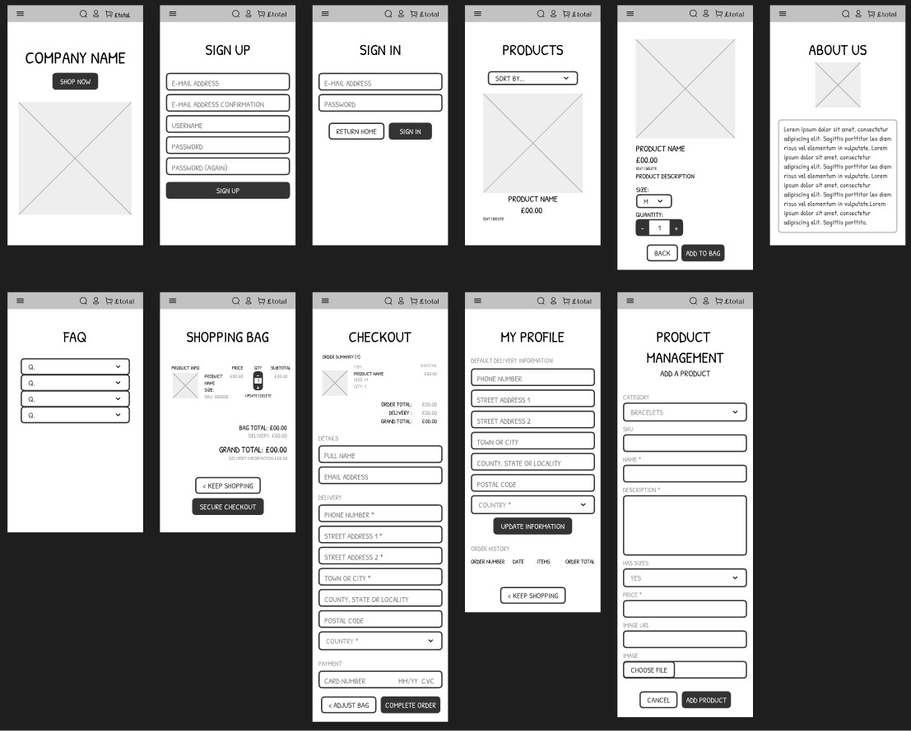
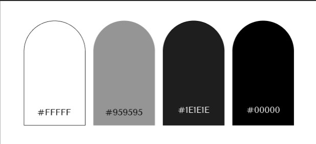
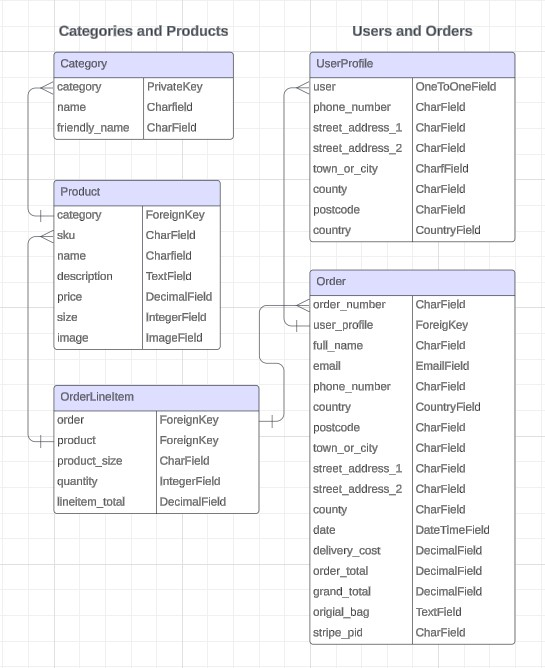

# craft collective. <!-- omit in toc -->
**A fictional e-commerce jewellery store using Django and Stripe** 

[Link to Testing](link)

[Link to live site](link)

# Table of Contents <!-- omit in toc -->
- [1. Website Information](#1-website-information)
- [2. UX](#2-ux)
  - [2.1 Strategy](#21-strategy)
  - [2.2 Scope](#22-scope)
  - [2.3 Structure](#23-structure)
  - [2.4 Skeleton](#24-skeleton)
  - [2.5 Surface](#25-surface)
- [3. Database Design](#3-database-design)
- [4. Error Handling](#4-error-handling)
- [5. Technologies Used](#5-technologies-used)
- [6. Defensive Programming](#6-defensive-programming)
- [7. Future Goals](#7-future-goals)
- [8. Testing](#8-testing)
- [9. Deployment](#9-deployment)
  - [Heroku Deployment](#heroku-deployment)
- [10. Credits and Acknowledgments](#10-credits-and-acknowledgments)

## 1. Website Information
### Website Sections
* Index
* Log In
* Sign Up
* All Products Page
* Individual Product Page
* Shopping Bag
* Checkout Page
* About Us Page
* Frequently Asked Questions Page
* User -  Profile Page
* Admin - Add Product Page
* Admin - Edit Product Page

## 2. UX/UI Design
### 2.1 Strategy
#### Target User
* **Age:** Likely 18 - 40 years old, with a possible skew towards females
* **Location:** Primarily based on the UK but could also target international customers interested in British handcrafted jewellery. 
* **Interests:** Loves unique, handcrafted jewellery with a story. 
* **Goals:** Seeks jewellery that reflects their personality and individuality. Wants to avoid mass-produced products and trends as well as over-priced pieces. 
* **Values:** Sustainability, ethi+cal sourcing, and supporting small businesses.
* **Personality:** Creative, expressive, enjoys standing out from the crowd

#### User Goals
**Shopper**
1. I want to be able to view a list of products to purchase.
2. I want to be able to view products from a specific category.
3. I want to be able to view the details of individual products.
4. I want to be able to easily view the total of my purchases at an time.
5. I want to be able to sort the list of available products.
6. I want to be able to sort a specific category of product.
7. I want to be able to search for a product by name or description.
8. I want to be able to easily see what I've searched for and the number of results.
9. I want to be able to easily select the size, metal type and quantity of a product when purchasing it.
10. I want to be able to view items in my bag before purchasing.
11. I want to be abe to adjust the quantity of the individual items in my bag.
12. I want to be able to easily enter payment information.
13. I want to be able to feel my personal information is safe and secure.
14. I want to be able to view an order confirmation after checkout.
15. I want to be able to receive an email confirmation after checking out.

**Site User**
1. I want to be able to easily register for an account.
2. I want to be able to easily login or logout.
3. I want to be able to easily recover my password in case I forget it.
4. I want to be able to receive an email confirmation after registering.
5. I want to have a personalised user profile.

**Store Owner**
1. I want to be able to add a product.
2. I want to be able to edit/update a product.
3. I want to be able to delete products.

#### Website/Business Goals

### 2.2 Scope
#### Features

|Index Page|A simple landing page navigating users to various other pages of the site|
|:---:|---|
|`Nav Bar`|A responsive navigation bar that allows the user to easily navigate around the site|
|`H1`|Used for the logo/title|
|`Large Button`|A button navigating the user to view all products|
|`H4`|Used to inform user of the free delivery minimum|

|All Products Page|A view for the users to view all products|
|:---:|---|
|`Nav Bar`|A responsive navigation bar that allows the user to easily navigate around the site|
|`H2`|Used for the page title|
|`P`|Used to display the total number of products on the page|
|`Select`|A dropdown box with a variety of sort options|
|`img`|Used to display an image of the product and links to the specific product's description page|
|`P`|Used to display the name of the product as well as the product price|

|Product Detail Page||

### 2.3 Structure
#### Userflow

### 2.4 Skeleton
#### Wireframes

**Mobile**

### 2.5 Surface
| Type | Image | Description|
|:---:|---|---|
|Typography|||
|Colours||I chose to use a simple white, black and grey colour scheme in order to keep accessibility scores high. Given the majority of the site is fairly image heavy I also didn't want the background/text to over power the products. By keeping the colour palette clean, the products are kept the main focus of the site.|
|Images|||

## 3. Database Design
I opted to use a relational database as it allows for easier and more structured connections between related data. In order to visualise this my site data I used [Lucid Chart](https://www.lucidchart.com/) to design my database tables and how they would relate to one another.

**Category**

**Product**

**User Profile**

**Order**

**Order Line Item**

## 4. Error Handling

## 5. Technologies Used
### Languages
[CSS](https://developer.mozilla.org/en-US/docs/Learn/Getting_started_with_the_web/CSS_basics) (Cascading Style Sheets) - used to add design to the HTML structure

[HTML](https://developer.mozilla.org/en-US/docs/Web/HTML) (HyperText Markup Language) - used to create the structure of the web pages

[JavaScript](https://www.javascript.com/) - used to add interactivity and animations

[Markdown](https://www.markdownguide.org/) - used to format README and TESTING files

[Python](https://www.python.org/) - used to create the backend of the site, including models, forms, url pathways

### Frameworks & Libraries
[Django](https://www.djangoproject.com/) - used to quickly create apps and adding authentication

[jQuery](https://jquery.com/) - used to write short and concise javascript

[Jinja](https://jinja.palletsprojects.com/en/3.1.x/) - used to create templates that can be extended upon. Also allows for insertion of backend data and url links.

### Design
[Affinity](https://affinity.serif.com/en-gb/designer/) - a design tool used to resize and export images and change file types

[Figma](https://www.figma.com/) - a design and prototyping tool used for UI/UX Design. I used figma to create responsive wireframes for each page of the web app.

[Google Fonts](https://fonts.google.com/) - a free, open-source collection of web fonts provided by Google. Using CSS I integrated and applied two of my selected fonts into the web app.

### Other
[Heroku](https://www.heroku.com/home) - a cloud platform as a service (PaaS) that simplifies the deployment, management and scaling of web applications. Using Heroku I was able to connect both front and back end of my app and deploy the site successfully.

## 6. Defensive Programming

## 7. Future Goals

## 8. Testing

## 9. Deployment

## 10. Credits and Acknowledgments
* [Affinity](https://affinity.serif.com/en-gb/designer/) - Used to resize images.
* [Django](https://www.djangoproject.com/) - Used to create site.
* [CSS](https://developer.mozilla.org/en-US/docs/Learn/Getting_started_with_the_web/CSS_basics) - Used to style site.
* [Figma](https://www.figma.com/) - Used to create wireframes.
* [Google Fonts](https://fonts.google.com/) - Used for fonts across the site.
* [Heroku](https://www.heroku.com/home) - Used to deploy the site.
* [HTML](https://developer.mozilla.org/en-US/docs/Web/HTML) - Used to create site structure.
* [JavaScript](https://www.javascript.com/) - Used to add interactivity and animation.
* [jQuery](https://jquery.com/) - Used to write JS.
* [Jinja](https://jinja.palletsprojects.com/en/3.1.x/) - Used for templating.
* [Lucid Chart](https://www.lucidchart.com/) - Used to create visual database schema.
* [Markdown](https://www.markdownguide.org/) - Used to format README and TESTING.
* [Python](https://www.python.org/) - Used for coding functions and classes.
