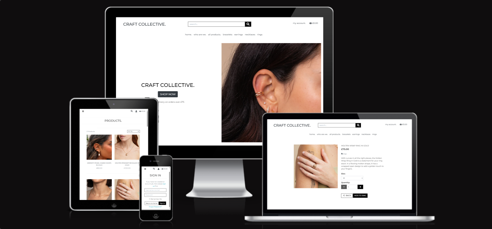
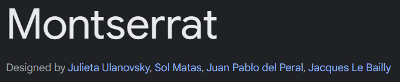
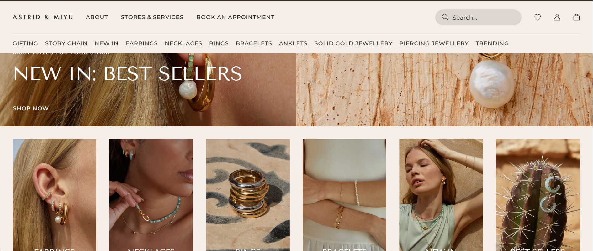

# craft collective. <!-- omit in toc -->
**A fictional e-commerce jewellery store using Django and Stripe** 

[Link to live site](https://craft-collective-04be76258b34.herokuapp.com/)

In order to make an example purchase a specific card number is required:
|Card Number|Date|CVC|Postal Code|
|---|---|---|---|
|4242 4242 4242 4242|any date|any 3 numbers|any 5 numbers|

# Table of Contents <!-- omit in toc -->
- [1. Website Information](#1-website-information)
- [2. UX](#2-ux)
  - [2.1 Strategy](#21-strategy)
    - [2.1.1 Target User](#211-target-user)
    - [2.2.2 User Goals](#222-user-goals)
    - [2.2.3 Website/Business Goals](#223-websitebusiness-goals)
  - [2.2 Scope](#22-scope)
    - [2.2.1 Features](#221-features)
    - [2.2.2 Error Handling](#222-error-handling)
    - [2.2.3 Defensive Programming](#223-defensive-programming)
    - [2.2.4 Future Goals](#224-future-goals )
  - [2.3 Structure](#23-structure)
    - [2.3.1 Database Design](#231-database-design)
  - [2.4 Skeleton](#24-skeleton)
  - [2.5 Surface](#25-surface)
- [3. Technologies Used](#3-technologies-used)
  - [3.1 Languages](#31-languages)
  - [3.2 Frameworks](#32-frameworks)
  - [3.3 Libraries & Packages](#33-libraries--packages)
  - [3.4 Database](#34-database)
  - [3.5 Design](#35-design)
  - [3.6 Other](#36-other)
  - [3.7 Stripe](#37-stripe)
- [4. Testing](#4-testing)
- [5. Deployment](#5-deployment)
- [6. Credits and Acknowledgments](#6-credits-and-acknowledgments)

## 1. Website Information
### Website Sections
* Index
* Log In
* Sign Up
* Products
* Product Description
* Shopping Bag
* Checkout
* Checkout Success
* About Us
* Frequently Asked Questions
* User -  Profile Page
* Admin - Add/Edit Product Page

## 2. UX/UI Design
### 2.1 Strategy
#### 2.1.1 Target User
* **Age:** Likely 18 - 40 years old, with a possible skew towards females
* **Location:** Primarily based on the UK but could also target international customers interested in British handcrafted jewellery. 
* **Interests:** Loves unique, handcrafted jewellery with a story. 
* **Goals:** Seeks jewellery that reflects their personality and individuality. Wants to avoid mass-produced products and trends as well as over-priced pieces. 
* **Values:** Sustainability, ethical sourcing, and supporting small businesses.
* **Personality:** Creative, expressive, enjoys standing out from the crowd

#### 2.2.2 User Goals
**Shopper**
1. I want to be able to view a list of products to purchase.
2. I want to be able to view products from a specific category.
3. I want to be able to view the details of individual products.
4. I want to be able to easily view the total of my purchases at an time.
5. I want to be able to sort the list of available products.
6. I want to be able to sort a specific category of product.
7. I want to be able to search for a product by name or description.
8. I want to be able to easily see what I've searched for and the number of results.
9. I want to be able to easily select the size, metal type and quantity of a product when purchasing it.
10. I want to be able to view items in my bag before purchasing.
11. I want to be able to adjust the quantity of the individual items in my bag.
12. I want to be able to easily enter payment information.
13. I want to be able to feel my personal information is safe and secure.
14. I want to be able to view an order confirmation after checkout.
15. I want to be able to receive an email confirmation after checking out.

**Site User**
1. I want to be able to easily register for an account.
2. I want to be able to easily login or logout.
3. I want to be able to easily recover my password in case I forget it.
4. I want to be able to receive an email confirmation after registering.
5. I want to have a personalised user profile.

#### 2.2.3 Website/Business Goals
**Store Owner**
1. I want to be able to add a product.
2. I want to be able to edit/update a product.
3. I want to be able to delete products.

### 2.2 Scope
#### 2.2.1 Features
|Index/Home|A simple landing page navigating users to begin shopping|
|---|---|
|`Nav Bar`|A fully responsive navigation bar used to navigate the site, displays current shopping bag total and allows user to search for specific products|
|`Hero Section`|Including a page title with the brand name, a large button directing users to the products page and an image showcasing the type of product the site sells|

|All Products|A view for the users to view all products|
|---|---|
|`Nav Bar`|A fully responsive navigation bar used to navigate the site, displays current shopping bag total and allows user to search for specific products|
|`Page Header`|Used to identify the page|
|`Category Name`|If user has selected a specific category, the name of the category is displayed at the top of the page|
|`Sort By`|A dropdown box allowing the user to sort the products by a variety of criteria (i.e. Price low to high, Category A-Z)|
|`Search Term`|If the user has searched for a product/description this area will display the searched term|
|`Product Card`|Displays the image, name and price of each product|
|`Edit` and `Delete`|If the user is logged in as an admin these buttons allow them to edit or delete the product from the site|
|`Back to top`|A button that appears at the bottom right of the screen when scrolling, when clicked, takes user back to the top of the page|

|Product Details|A view for the users to view extra details on a specific product|
|---|---|
|`Nav Bar`|A fully responsive navigation bar used to navigate the site, displays current shopping bag total and allows user to search for specific products|
|`Product Image`|Displays an image of the product|
|`Product Details`|Displays information about the product, name, price, description|
|`Edit` and `Delete`|If the user is logged in as an admin these buttons allow them to edit or delete the product from the site|
|`Size Selection`|If the product has a size associated with it then a dropdown box will show allowing the user to select a size|
|`Quantity Selector`|Comprises of a button to decrease the quantity by 1, an input field that displays the current quantity and a button to increase the quantity by 1|
|`Back Button`|A button that direct user back to the products page|
|`Add to Bag Button`|A button that adds the item to the users shopping bag|

|Login|A page for users to log in to their previously registered account|
|---|---|
|`Nav Bar`|A fully responsive navigation bar used to navigate the site, displays current shopping bag total and allows user to search for specific products|
|`Page Header`|Used to identify the page|
|`Message`|A message with a link to the sign up page if they have not already registered for an account|
|`Login Form`|A form requiring user's login information|
|`Return Home Button`|Directs the user back to the index page|
|`Sign In Button`|A button that submits sign in form and logs the user into their account|
|`Forgot Password?`|If the user has forgotten their password this will redirect them to a page to reset their password via an email|

|Sign Up|A page for users to sign up for an account|
|---|---|
|`Nav Bar`|A fully responsive navigation bar used to navigate the site, displays current shopping bag total and allows user to search for specific products|
|`Page Header`|Used to identify the page|
|`Sign Up Form`|A form prompting users to input their details in order to create an account|
|`Sign Up Button`|A button that submits the sign up form and creates and account for the user|
|`Sign In Link`|A message with a link that redirects users to sign in page if they already have a registered account|

|Shopping Bag|A view for the users to view products in their shopping bag, allowing them to edit quantities or remove items and continue on to checkout page|
|---|---|
|`Nav Bar`|A fully responsive navigation bar used to navigate the site, displays current shopping bag total and allows user to search for specific products|
|`Page Header`|Used to identify the page|
|`Bag Item Table`|Used to display information about the products that are in the users shopping bag: Item image, size, quantity, subtotal|
|`Quantity Editor`|Comprises of a button to decrease the quantity by 1, an input field that displays the current quantity and a button to increase the quantity by 1|
|`Update` and `Remove`|Two anchor elements, `Update` updates the quantity of the item selected if changed. `Remove` removes the item from the bag completely|
|`Total Section`|Below the bag item table is a section in which all totals are shown, bag total, delivery total and grand total. It also displays a message notifying the customer on how much more they need to spend in order to qualify for free shipping|
|`Keep Shopping` and `Secure Checkout`|At the bottom of the page are two buttons navigating users either back to the products page in order to keep shopping or to continue on to checkout page|
|`Empty Bag Page`|If the user doesn't have any items in their bag then they will see a message informing them of their empty bag and a button to direct the user back to the products page in order to keep shopping|

|Checkout|A page allowing the user to input delivery and billing information in order to complete their purchase|
|---|---|
|`Nav Bar`|A fully responsive navigation bar used to navigate the site, displays current shopping bag total and allows user to search for specific products|
|`Page Header`|Used to identify the page|
|`Order Summary`|Gives the user a summary of their order, displaying product images, names, sizes, quantities and prices|
|`Order Price information`|Displays the order total, the delivery total and the grand total (order + delivery) to the user|
|`Payment Form`|A form that prompts users to input their delivery and contact information|
|`Create an account` or `login`|Two links within a message prompting users to either sign in or create an account|
|`Stripe`|An field for users to input their card details in order to make a payment, there is also a message field that displays any errors|
|`Adjust Bag`|A button that redirects user back to the shopping bag button|
|`Complete Order`|A button that submits the order form and completes the purchase|
|`Loading Overlay`|When the payment is being processed a loading overlay covers the screen with a loading animation icon|

|Checkout Success|A page confirming the success of the payment/order and displaying the order details|
|:---:|---|
|`Nav Bar`|A fully responsive navigation bar used to navigate the site, displays current shopping bag total and allows user to search for specific products|
|`Page Header`|Used to identify the page|
|`Order Information`|Displays the order number and date|
|`Order Details`|Displays item size and quantity|
|`Delivery Information`|Displays user's name, address, postcode and phone number|
|`Billing Information`|Displays order total, delivery cost and grand total|
|`Back to Profile`|A button that redirects users back to their profile page|
|`Keep Shopping`|A button that redirects users back to the products page|

|About Us|A page giving the user information about the brand/site owners|
|---|---|
|`Nav Bar`|A fully responsive navigation bar used to navigate the site, displays current shopping bag total and allows user to search for specific products|
|`Page Header`|Used to identify the page|
|`Image`|An image of the site owners|
|`About us`|A couple of paragraphs explaining the history of the brand and who they are|

|Frequently Asked Questions|A page showing frequently asked questions about the site/brand|
|---|---|
|`Nav Bar`|A fully responsive navigation bar used to navigate the site, displays current shopping bag total and allows user to search for specific products|
|`Page Header`|Used to identify the page|
|`Accordion`|A series of accordion dropdowns, displaying a question and allowing users to view the answer when clicked|
|`Keep Shopping`|A button directing the user to the product page|

|User - Profile Page|A personalised page allowing users to update their delivery information and view previous orders|
|---|---|
|`Nav Bar`|A fully responsive navigation bar used to navigate the site, displays current shopping bag total and allows user to search for specific products|
|`Page Header`|Used to identify the page|
|`Delivery Information`|A form for users to input default delivery information at the bottom of the form is an `Update Information` button that submits the form and saves the information for later use at checkout|
|`Order History`|A table of information displaying previous orders. The table shows order numbers, order dates, products in each order and the grand total of the order. If the user clicks the order number they are redirected to the order confirmation page|
|`Keep Shopping`|A button at the bottom of the page that redirects the user back to the products page|

|Admin - Product Management|A page allowing the site owner to add/edit products on the site|
|---|---|
|`Nav Bar`|A fully responsive navigation bar used to navigate the site, displays current shopping bag total and allows user to search for specific products|
|`Page Header`|Used to identify the page|
|`Subtitle`|Defines if the page is to add a new product or edit a currently existing product|
|`Add Product Form` or `Edit Product Form`|If the user is adding a new product they are prompted to fill in an empty form in order to add a new product to the store. If the user is editing an existing product the same form will be preloaded with existing data about the selected product|
|`Cancel`|A button allowing the user to cancel the adding or editing of the product. This button redirects the user back to the products page|
|`Add/Update Product`|Depending on the page, this button submits the form and either adds or updates the product information|

#### 2.2.2 Error Handling
In order to handle any errors I have created both a 404 HTML code page that notifies the user the page they're looking for doesn't exist and provides a button to return back to the home page. I have also created a 500 HTML code page that informs the user of an internal server error and offers a button to redirect back to the home page.

Within my python code I have also implemented a `get_object_or_404` function. In the event that an object (in this case a product) within my database either cannot be found or does not exist a 404 error code is created. Using this during development I am able to pinpoint where the issue might be coming from, in deployment this stops users from being able to purchase products that do not exist.

I also have a used toast feature that pops up in the top right hand corner that provides a feedback loop for any actions the user makes during their interaction with the site. These toasts cover everything from when a user has successfully added an item, it also notifies users of any errors that they may encounter.

#### 2.2.3 Defensive Programming
Throughout the site I have implemented defensive programming in order to keep it safe. Using Jinja templating to checking if the user is a superuser I am able to block access to admin related pages, I also used it in order to check if the user was in session, determining which account options are available. If the user is not logged in they have the option to 'register' or 'Login', if the user is logged in they can view their profile or sign out.

Within my Profile python code I have also used python auth decorators, specifically `login_required`. This means that users cannot access admin/user profiles unless they are logged in, it also stops users from accessing these pages by simply typing the url. If a user does not have the required permissions to access a page then an error toast will pop up notifying the user of the issue.

#### 2.2.4 Future Goals
In future iterations of the web app I would like to expand the database model, this would include adding an additional option to select a metal type. I’d implement this in a similar way to the size options, users would be able to select a metal type from a dropdown select box.

I’d also alter the categories model by creating a many to many field allowing for products to have multiple categories at the same time. An example would be a ring would be able to be ‘Gold’, ‘Hoops’ and ‘Earrings. This would mean that users could narrow down their search further. 

### 2.3 Structure
#### 2.3.1 Database Design
I opted to use a relational database as it allows for easier and more structured connections between related data. In order to visualise this my site data I used [Lucid Chart](https://www.lucidchart.com/) to design my database tables and how they would relate to one another.

**Category Table**
The category table in my database schema represents the the categories of products, these include 'Rings', 'Necklaces' etc. Each category has a private key associated which ensure each category is unique and allows it to be linked to the products table using a foreign key. 

**Product Table**
The product table includes a detailed set of information about each product, the SKU number, name, price and image as well as the foreign key connecting to a specific category. This information allows for the searching and organisation of products in a variety of ways and allows the site to display everything needed.

**User Profile Table**
The user profile table includes information for each individual user, this includes things like phone number, address, postcode etc. When a user creates a new order their profile is linked to the order table using a foreign key.

**Order Table**
The order table combines information from both the products table and the user profile table. The information from the user profile table, using a foreign key, shows who placed the order and the products the user has chosen are linked using another foreign key. 

### 2.4 Skeleton
#### 2.4.1 Wireframes
**Mobile**

**Desktop**

### 2.5 Surface
| Type | Image | Description|
|:---:|---|---|
|Typography||I chose a simple, rounded font from google fonts called 'Montserrat'. This gives a clean sophisticated look across the whole website and is also easy to read. It translates well from main text to bolder heading and by using it throughout, it maintains a level of cohesion.|
|Colours||I chose to use a simple white, black and grey colour scheme in order to keep accessibility scores high. Given the majority of the site is fairly image heavy I also didn't want the background/text to over power the products. By keeping the colour palette clean, the products are kept the main focus of the site.|
|Images||In order to create an example of how the site would look with product images I chose to take images from a pre-existing jewellery business [Astrid & Miyu](https://www.astridandmiyu.com/). I wanted to use bright imagery as a visual explanation as to why I felt keeping the site clean and light would showcase the products. I also used Google Images for my 'About Us' page.|

## 3. Technologies Used
### 3.1 Languages
- [CSS](https://developer.mozilla.org/en-US/docs/Learn/Getting_started_with_the_web/CSS_basics)
- [HTML](https://developer.mozilla.org/en-US/docs/Web/HTML)
- [JavaScript](https://www.javascript.com/)
- [Markdown](https://www.markdownguide.org/)
- [Python](https://www.python.org/)

### 3.2 Frameworks
- [Bootstrap](https://getbootstrap.com/) - A framework that uses classes and JS to help build responsive, mobile first sites

- [Django](https://www.djangoproject.com/) - A Python web framework that aids in quick development of apps as well as clean design.

### 3.3 Libraries & Packages
- [boto3](https://pypi.org/project/boto3/) - Allows connection to AWS S3 bucket

- [botocore](https://pypi.org/project/botocore/) - The foundation for the AWS CLI and boto3

- [dj-database-url](https://pypi.org/project/dj-database-url/) - Allows the utilisation of the DATABASE_URL variable

- [Django Allauth](https://docs.allauth.org/en/latest/) - Used for authentication, registration and account management

- [django-countries](https://pypi.org/project/django-countries/) - Provides country choices for use with forms and country field for models

- [django-crispy-forms](https://pypi.org/project/django-crispy-forms/) - Builds programmatic reusable layouts for Django forms

- [django-storages](https://pypi.org/project/django-storages/) - A storage backend library

- [Font Awesome](https://fontawesome.com/) - A library of icons

- [gunicorn](https://pypi.org/project/gunicorn/) - A Python WSGI HTTP Server

- [pillow](https://pypi.org/project/pillow/) - A Python imaging library

- [psycopg2](https://pypi.org/project/psycopg2/) - A postgres database adapter allowing connection with a postgres database

- [jQuery](https://jquery.com/) - V 3.4.1 - A JavaScript framework

- [Jinja](https://jinja.palletsprojects.com/en/3.1.x/) - A templating engine similar to Python syntax

### 3.4 Database
- [Code Institute DB Maker](https://dbs.ci-dbs.net/) - Used to create database for deployment

- sqlite3 - Used as a database during development

### 3.5 Design
- [Affinity](https://affinity.serif.com/en-gb/designer/) - A design tool used to resize and export images and change file types

- [Figma](https://www.figma.com/) - A design and prototyping tool used for UI/UX Design

- [Google Fonts](https://fonts.google.com/) - a free, open-source collection of web fonts provided by Google 

### 3.6 Other

- [Git](https://git-scm.com/) - Version control

- [GitHub](https://github.com/) - Saves and stores files for the project

- [Google Dev Tools](https://developer.chrome.com/docs/devtools/) - Helps diagnose problems quickly and test features

- [pip](https://pypi.org/project/pip/) - Used for installing packages in the terminal

### 3.7 Stripe
[Stripe](https://stripe.com/gb) is used to implement the payment system.

Stripe is in developer mode which allows for us to process test payments to check how the site functions in different situations

|Type|Card No.|Date|CVC|
|---|---|---|---|
|Success|4242 4242 4242 4242|4242|Any future date|
|Require Authorisation|4000 0025 0000 3155|Any future date|Any 3 digits|
|Declined|4000 0000 0000 0002|Any future date|Any 3 digits|

## 7. Testing
To view testing documentation: 
[Link to Testing](https://github.com/lrchnnng/craft-collective/blob/main/TESTING.md)

## 8. Deployment
**Creating the database**

Due to ElephantSQL coming to the end of their life I decided to use Code Institutes Database Maker to create a database for this project. During development I was using sqlite3 however this isn't usable within deployment.

**Heroku CLI**

Since I already have an account with Heroku I was able to do the majority of the deployment through the terminal.

1. `heroku login -i` - You can either enter your credentials within the terminal or it will open a new browser winder allowing you to log in.

2. `heroku create app-name` - You then create a new Heroku app, this name needs to be unique.

3. `heroku config:set VAR_NAME='variable' --app app-name` - Adding any necessary environment variables will help with a number of things.
    - `AWS_ACCESS_KEY_ID` - Connect to AWS S3 Bucket (Static and Media files)
    - `AWS_SECRET_ACCESS_KEY` - Connect to AWS S3 Bucket (Static and Media files)
    - `DATABASE_URL` - Connects to database
    - `SECRET_KEY` - Connects to app
    - `USE_AWS` - Allows use of AWS
    - `DJANGO_DEBUG` - Set debug mode to True or False depending on if you are in development mode

4. `git add .`
   `git commit -m` - Creates a commit message

5. `heroku git:remote -a app-name` - Links your Heroku app to Git repository

6. `git push heroku main` - Pushes changes to both main branch and initiates a build of your app

7. `heroku run python3 manage.py migrate --app app-name` - If necessary, at this stage you can run any database migrations

8. `heroku open --app app-name` - Opens the deployed app in a web browser

**Browser Deployment**
I chose to connect my app to GitHub in order to manually deploy the app once I had finished with development. 

## 9. Credits and Acknowledgments
* [Affinity](https://affinity.serif.com/en-gb/designer/) - Used to resize images.
* [Astrid & Miyu](https://www.astridandmiyu.com/) - Used for images of jewellery
* [Django](https://www.djangoproject.com/) - Used to create site
* [ChatGPT 4](https://chat.openai.com/) - Used to find possible solutions to major issues in my code
* [Code Institute](https://learn.codeinstitute.net/dashboard) - Used for source code and learning materials
* [Code Institute DB Maker](https://dbs.ci-dbs.net/) - Used to create my database for deployment
* [Code Institute Python Linter](https://pep8ci.herokuapp.com/) - Used to check and fix python errors
* [CSS](https://developer.mozilla.org/en-US/docs/Learn/Getting_started_with_the_web/CSS_basics) - Used to style site
* [Figma](https://www.figma.com/) - Used to create wireframes
* [Google Fonts](https://fonts.google.com/) - Used for fonts across the site
* [Heroku](https://www.heroku.com/home) - Used to deploy the site.
* [HTML](https://developer.mozilla.org/en-US/docs/Web/HTML) - Used to create site structure
* [JavaScript](https://www.javascript.com/) - Used to add interactivity and animation
* [jQuery](https://jquery.com/) - Used to write JS
* [Jinja](https://jinja.palletsprojects.com/en/3.1.x/) - Used for templating
* [Lucid Chart](https://www.lucidchart.com/) - Used to create visual database schema
* [Markdown](https://www.markdownguide.org/) - Used to format README and TESTING
* [Python](https://www.python.org/) - Used for coding functions and classes

Special thanks to Agy Luczak for being a fantastic sounding board, to Ashley Oliver for providing me with encouragement and motivation every thursday and my partner Sami Tamminen-Jackson for being patient with me and buying me snacks when I needed an extra boost!