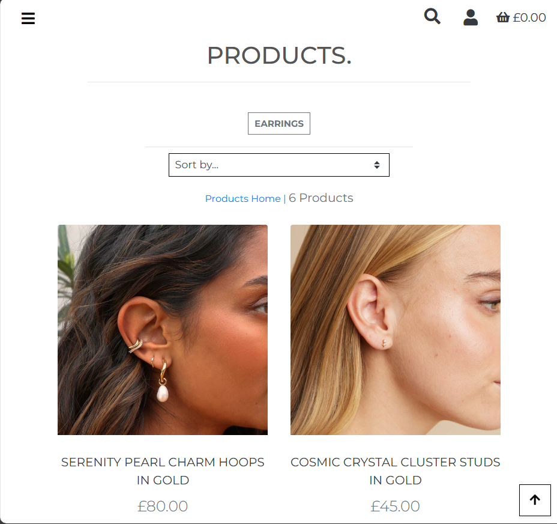
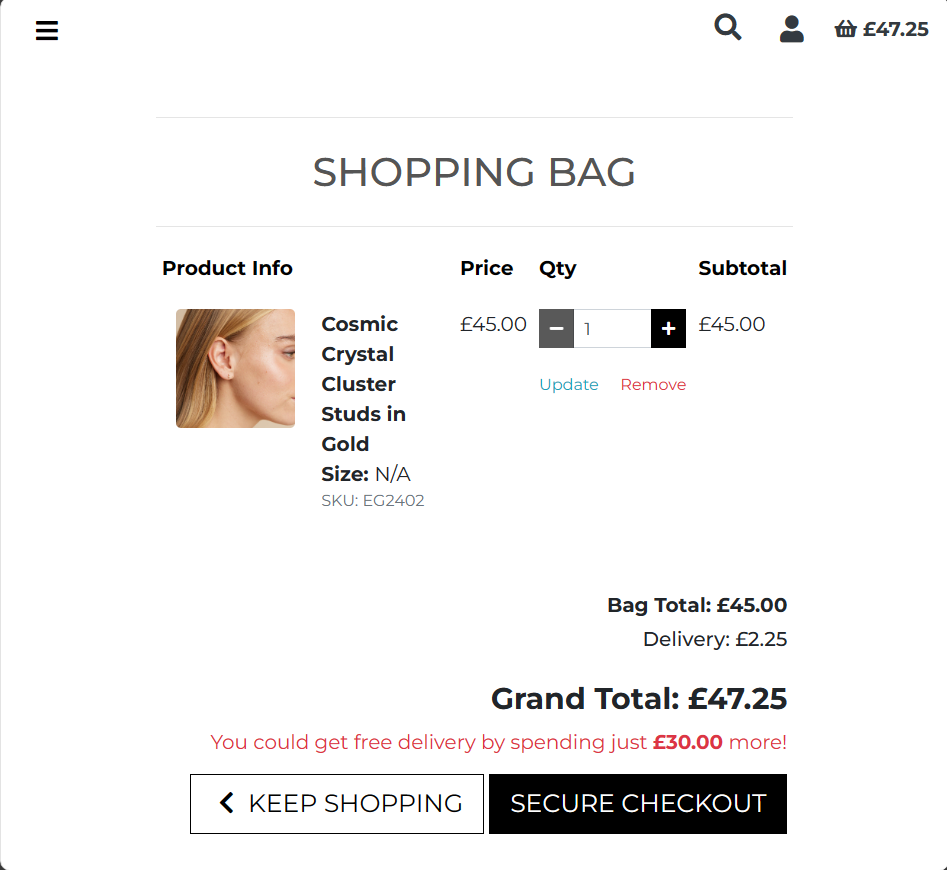
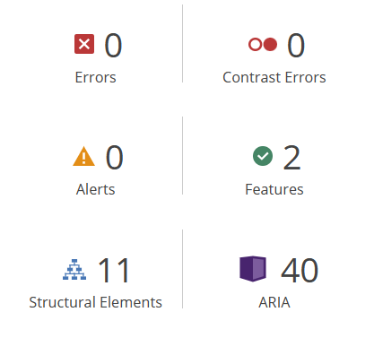
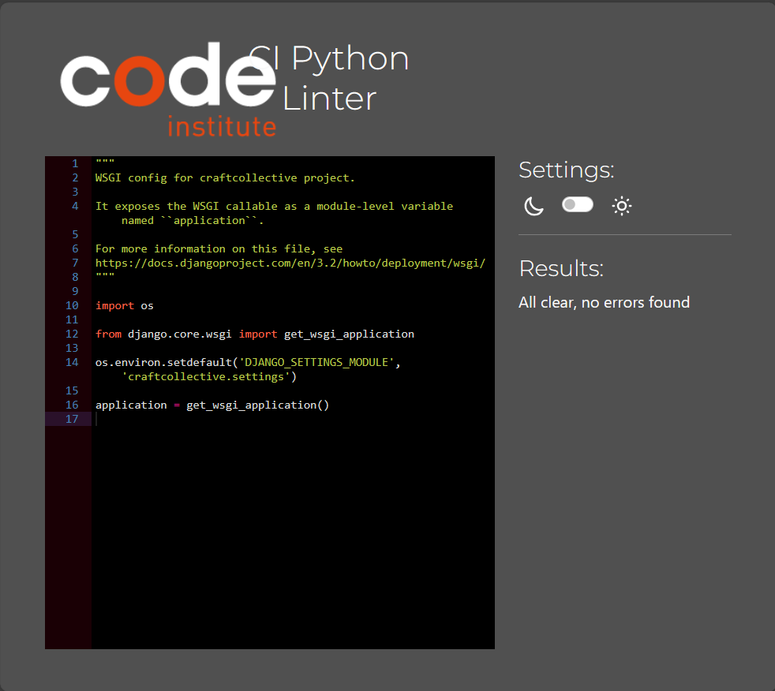

[Return to README](https://github.com/lrchnnng/craft-collective/blob/main/README.md)

# Testing <!-- omit from toc -->
- [Automated vs Manual Testing](#automated-vs-manual-testing)
- [Manual Testing](#manual-testing)
    - [Responsivity Testing](#responsivity-testing)
    - [Page Testing](#page-testing)
    - [User Story Testing](#user-story-testing)
- [Automated Testing](#automated-testing)
    - [HTML Validation](#html-validation)
    - [CSS Validation](#css-validation)
    - [Wave Accessibility Evaluation](#wave-accessibility-evaluation)
    - [Lighthouse Testing](#lighthouse-testing)
    - [Python Testing](#python-testing)
- [Known bugs and fixes](#known-bugs-and-fixes)

## Automated vs Manual Testing

## Manual Testing
### Responsivity Testing
|Responsivity | Mobile S (320px)| Mobile L (425px)| Tablet (768px) | Desktop (1024px)|
|---|:---:|:---:|:---:|:---:|
|Responsive UI Components|✓|✓|✓|✓|
|Responsive Text|✓|✓|✓|✓|
|Responsive Forms|✓|✓|✓|✓|
|Responsive Button Placement|✓|✓|✓|✓|
|Responsive Nav Bar|✓|✓|✓|✓|
|Responsive Footer|✓|✓|✓|✓|

### Page Testing
|Nav Bar Testing|Yes/No|
|---|:---:|
|Nav bar text and styles are loaded|✓|
|Mobile header appears up to medium sized screens|✓|
|All nav links work as intended|✓|
|Nav logo directs user to index page|✓|
|If user logged in as admin, nav bar shows `Product Management`, `My Profile` and `Logout` links|✓|
|If user is logged in but not admin, nav bar shows `My Profile` and `Logout` links|✓|
|If user is not logged in, nav bar shows `Register` and `Login`|✓|
|`home.` links to the index page|✓|
|`who we are.` triggers a dropdown menu for `about us.` and `FAQ.`|✓|
|`about us.` links to about us page|✓|
|`FAQ.` links to FAQ page|✓|
|`all products.` links to all products page|✓|
|`bracelets.` links to bracelets category page|✓|
|`earrings.` links to earrings category page|✓|
|`necklaces.` links to necklaces category page|✓|
|`rings` links to rings category page|✓|
|In mobile view `search icon` triggers a drop down input field|✓|
|`search bar` allows text input and searches products|✓|
|`bag` total price updates when item is added to the bag and when clicked directs user to the bag page|✓|
|When user is logged in as admin - `Product Management` links to `Add Product` page|✓|

|Toasts Testing|Yes/No|
|---|:---:|
|`Alert Toast` appears when editing a product|✓|
|`Alert Toast` appears when prompting email verification when user signs up|✓|
|`Success Toast` appears when signed out|✓|
|`Success Toast` appears when email address is confirmed|✓|
|`Success Toast` appears when user successfully signs into their account|
|`Success Toast` appears when user changes password successfully|✓|
|`Success Toast` appears when a product is deleted|✓|
|`Success Toast` appears when user add a product to their bag|✓|
|`Success Toast` appears when user updates quantity in their bag|✓|
|`Success Toast` appears when user removes product from their bag|✓|

|Success Toast Testing|Yes/No|
|---|:---:|
|Fonts and Image have loaded|✓|
|Correct product name is displayed in success message|✓|
|Total quantity of products in shopping bag is displayed|✓|
|Correct product image is displayed|✓|
|Correct product name is displayed next to product image|✓|
|If the product has a size, size of product is displayed and accurate|✓|
|Product quantity is correct and displayed|✓|
|Shopping bag total is correct and displayed|✓|
|Delivery message is shown if shopping bag is below free delivery threshold and calculated accurately|✓|
|`Go to Shopping Bag` button redirects user to Shopping Bag page|✓|

|Index Page Testing|Yes/No|
|---|:---:|
|Fonts and Image have loaded|✓|
|`Shop Now` button redirects to products page|✓|
|Free delivery threshold is displayed|✓|

|Login Testing|Yes/No|
|---|:---:|
|Fonts have loaded|✓|
|Form validation - Username/Email is required|✓|
|Form validation - Password is required|✓|
|Before form `sign up` link redirects user to Sign Up page|✓|
|`Return Home` button redirects user back to index page|✓|
|`Sign In` button logs user into their account, redirects to user Index page and triggers a `Success` toast|✓|

|Sign Up Testing|Yes/No|
|---|:---:|
|Fonts have loaded|✓|
|Form validation - Email is required|✓|
|Form validation - Email confirmation is required|✓|
|Form validation - Username is required|✓|
|Form validation - Password is required|✓|
|Form validation - Password confirmation is required|✓|
|`Sign Up` button is submits form and sends an email confirming sign up|✓|
|`Sign Up` button redirects user to Verify Your Address page and triggers an alert toast|✓|
|Under the form, `sign in` link redirects user to sign in page|✓|

|Products Page Testing|Yes/No|
|---|:---:|
|Fonts and images have loaded|✓|
|Product count is accurate to amount of products on the page|✓|
|`Sort by...` dropdown functions as expected|✓|
|`Sort by...` - Price (low to high) sorts products from lowest price to highest|✓|
|`Sort by...` - Price (high to low) sorts products from highest price to lowest|✓|
|`Sort by...` - Name (A-Z) sorts proructs in alphabetical order|✓|
|`Sort by...` - Name (Z-A) sorts products in reverse alphabetical order|✓|
|`Sort by...` - Category (A-Z) sorts product categories in alphabetical order|✓|
|`Sort by...` - Category (Z-A) sorts product categories in reverse alphabetical order|✓|
|'Category' Product Page - Category name badge at the top of the page shows name of current category|✓|
|'Category' Product Page - `Products Home` link redirects back to all products page|✓|
|'Category' Product Page - Product count is accurate to amount of products on the page|✓|
|Clicking image redirects user to product detail page|✓|
|Clicking product name redirects user to product detail page|✓|
|Non-Admin User - `Edit` and `Delete` buttons not visible|✓|
|Admin User - `Edit` and `Delete` buttons appear|✓|
|Admin User - `Edit` button redirects user to Edit Product page|✓|
|Admin User - `Delete` button deletes the product|✓|

|Product Detail Page Testing|Yes/No|
|---|:---:|
|Fonts and images have loaded|✓|
|Clicking image opens a new tab with image preview|✓|
|Category tag displays and is accurate to product|✓|
|Quantity `-` button does not work if quantity is 1|✓|
|Quantity `-` button decreased quantity by 1 if quantity is 2 or more|✓|
|Quantity input field can be altered|✓|
|If quantity input field is 0, user cannot add product to the bag|✓|
|Quantity `+` button increases product by 1 if quantity is 98 or less|✓|
|Quantity `+` button does not work if quantity is 99|✓|
|Non-Admin User - `Edit` and `Delete` buttons not visible|✓|
|Admin User - `Edit` and `Delete` buttons appear|✓|
|Admin User - `Edit` button redirects user to Edit Product page|✓|
|Admin User - `Delete` button deletes the product|✓|
|`Back` button redirects user to products page|✓|
|`Add to Bag` adds product to shopping bag and triggers Success toast|✓|

|About Us Page Testing|Yes/No|
|---|:---:|
|Font and image have loaded|✓|
|`Keep Shopping` button redirects to All Products page|✓|

|FAQ Page Testing|Yes/No|
|---|:---:|
|Fonts have fully loaded|✓|
|All accordian components work as expected|✓|
|`Keep Shopping` button redirects user to products page|✓|

|Shopping Bag Testing|Yes/No|
|---|:---:|
|Fonts have fully loaded|✓|
|Product image has loaded|✓|
|Product name is accurate|✓|
|If product item has a size, user's selected size is displayed|✓|
|SKU displays correctly|✓|
|Product price is accurate|✓|
|Quantity `-` button does not work if quantity is 1|✓|
|Quantity `-` button decreased quantity by 1 if quantity is 2 or more|✓|
|Quantity input field can be altered|✓|
|If quantity input field is 0, user cannot add product to the bag|✓|
|Quantity `+` button increases product by 1 if quantity is 98 or less|✓|
|Quantity `+` button does not work if quantity is 99|✓|
|Subtotal is calculated accurately|✓|
|`Update` button updates the quantity and subtotal|✓|
|When quantity is updated success toast is triggered|✓|
|`Remove` button removes product from the bag|✓|
|Bag total displays correctly|✓|
|Delivery displays correctly|✓|
|Grand total displays correctly|✓|
|If the shopping bag is below the free delivery threshold, free delivery message appears|✓|
|Free Delivery message calculates correctly|✓|
|`Keep Shopping` button redirects user to product page|✓|
|`Secure Checkout` button redirects user to checkout page|✓|
|If the shopping bag is empty a message notifies user|✓|
|If the shopping bag is empty `Keep Shopping` button redirects user to product page|✓|

|Checkout Page Testing|Yes/No|
|---|:---:|
|Fonts have fully loaded|✓|
|Product image has loaded|✓|
|Product name is accurate|✓|
|If product item has a size, user's selected size is displayed|✓|
|Product quantity is displayed correctly|✓|
|Subtotal displays correctly|✓|
|Order total displays correctly|✓|
|Delivery displays correctly|✓|
|Grand total displays correctly|✓|
|`Full Name` field is required|✓|
|`Email Address` field is required|✓|
|`Phone Number` field is required|✓|
|`Street Address 1` field is required|✓|
|`Street Address 2` field is not required|✓|
|`Town or City` field is required|✓|
|`County, State or Locality` field is not required|✓|
|`Postal Code` field is not required|✓|
|`Country` field is required|✓|
|Select option saves user delivery information to their profile|✓|
|Payment field works as expected|✓|
|`Adjust Bag` button redirects user back to shopping bag page|✓|
|`Complete Order` button sends payment to Stripe and completes order|✓|
|Information message appears below buttons warning users that the site is for educational purposes only|✓|
|Completing order triggers toast success and loading animation|✓|
|Completing order redirects user to checkout success page|✓|

|Checkout Success Page Testing|Yes/No|
|---|:---:|
|Fonts have fully loaded|✓|
|Correct email is displayed in confirmation message|✓|
|Correct order info is displayed|✓|
|Correct delivery details are displayed|✓|
|Correct billing info is displayed|✓|
|`Keep Shopping` button redirects user to products page|✓|

|Profile Page Testing|Yes/No|
|---|:---:|
|Fonts have fully loaded|✓|
|Form loads previously saved user data|✓|
|`Update Information` button saves updated data to user's account|✓|
|Order history appears as expected|✓|
|Order number links user to orders confirmation message|✓|
|Order date matches order confirmation|✓|
|Order items matches order confirmation|✓|
|Order total matches order confirmation|✓|
|`Keep Shopping` redirects user back to product page|✓|

|Product Management Page Testing|Yes/No|
|---|:---:|
|`Add Product` - Fonts and form have fully loaded|✓|
|`Add Product` - 'Category' dropdown shows all available categories|✓|
|`Add Product` - 'Name' field is required|✓|
|`Add Product` - 'Description' field is required|✓|
|`Add Product` - 'Price' field is required|✓|
|`Add Product` - 'Has sizes' dropdown works and shows available options|✓|
|`Add Product` - 'Choose File' successfully adds file to the form|✓|
|`Add Product` - `Cancel` button redirects back to products page|✓|
|`Add Product` - `Add Product` button adds product to the database and redirects admin user to the products detail page|✓|
|`Edit Product` - Fonts and form have fully loaded|✓|
|`Edit Product` - Form is prefilled with existing product information |✓|
|`Edit Product` - 'Category' dropdown shows all available categories|✓|
|`Edit Product` - 'Name' field is required|✓|
|`Edit Product` - 'Description' field is required|✓|
|`Edit Product` - 'Price' field is required|✓|
|`Edit Product` - 'Has sizes' dropdown works and shows available options|✓|
|`Edit Product` - 'Choose File' successfully adds file to the form|✓|
|`Edit Product` - `Cancel` button redirects back to products page|✓|
|`Edit Product` - `Update Product` button updates product information to the database and redirects admin user to the products detail page|✓|

### User Story Testing

**Shopper**
1. I want to be able to view a list of products to purchase.
2. I want to be able to view products from a specific category.
3. I want to be able to view the details of individual products.
4. I want to be able to easily view the total of my purchases at an time.
5. I want to be able to sort the list of available products.
6. I want to be able to sort a specific category of product.
7. I want to be able to search for a product by name or description.
8. I want to be able to easily see what I've searched for and the number of results.
9. I want to be able to easily select the size, and quantity of a product when purchasing it.
10. I want to be able to view items in my bag before purchasing.
11. I want to be abe to adjust the quantity of the individual items in my bag.
12. I want to be able to easily enter payment information.
13. I want to be able to feel my personal information is safe and secure.
14. I want to be able to view an order confirmation after checkout.
15. I want to be able to receive an email confirmation after checking out.

**Site User**
1. I want to be able to easily register for an account.
2. I want to be able to easily login or logout.
3. I want to be able to easily recover my password in case I forget it.
4. I want to be able to receive an email confirmation after registering.
5. I want to have a personalised user profile.

**Store Owner**
1. I want to be able to add a product.
2. I want to be able to edit/update a product.
3. I want to be able to delete products.

#### Viewing and Navigating
|User|I want to...|In order to...|Explaination|Image|
|---|---|---|---|---|
|Shopper|View a list of products|Select products to purchase|Within the products page there is a list of all of the products available across the site||
|Shopper|View specific categories of products|Quickly find products I'm interested in without having to search through all products|Within the nav bar there are category specific links to each category of product. This link directs the user to the category page| |
|Shopper|View individual product details|Identify the price, description, product image, available sizes|When the user selects a product they are directed to the product detail page||
|Shopper|Easily view the total of the purchases at any time|Avoid spending too much|When the user adds a product to the bag a popup message is created to notify the user that they have successfully added the item to the cart. The toast diplays the bag contents and the price of the items within the bag. The shopping bag total within the nav bar is also updated to reflect the bag total, making it easy to keep track of the bag total across the whole site| |

#### Registration and User Accounts
|User|I want to...|In order to...|Explaination|Image|
|---|---|---|---|---|
|Site User|Easily register for an account|Have personal account and be able to view my profile|Users can register for an account on the register page||
|Site User|Easily login or logout|Access my personal account information|User can log in and log out of their account through the nav bar|  |
|Site User|Easily recover my password in case I forget it|Recover access to my account|If the user has forgotten their password they can follow a link from the login page to the password reset page. Once they fill in the login form they will recieve an email with a link to reset their password|   |
|Site User|Receive an email confirmation after registering|Verify that my account registration was successful|When user registers for an account an email is sent asking for them to confirm registration by following a link||
|Site User|Have a personalised user profile|View personal order history and order confirmations, and save my payment information|Users have a personal profile page accessed through the nav bar account dropdown, This displays their default delivery information allowing them to save and update their information as well as showing any previous purchases| |

#### Sorting and Searching
|User|I want to...|In order to...|Explaination|Image|
|---|---|---|---|---|
|Shopper|Sort the list of available products|Easily identify the best rated, best prices and categorically sorted products|On the products page there is a `sort by` dropdown box that allows the user to sort the products by various criteria||
|Shopper|Sort a specific category of product|Find the best-priced or best-rated products in a specific category, or sort the products in that category by name|Within each category page the same sorting dropdwn box is available for users to sort each individual category or product||
|Shopper|Search for a product by name or description|Find specific product I’d like to purchase|In the nav bar is a search bar that allows users to search for terms that appear within both the product title and the product descriptions| |
|Shopper|Easily see what I’ve searched for and the number of results|Quickly decide whether the product I want is available |After searching, providing the search is successful, below the page title and product count is the term used to search||

#### Purchasing and Checkout
|User|I want to...|In order to...|Explaination|Image|
|---|---|---|---|---|
|Shopper|Easily select the size and quantity of a product when purchasing it|Ensure I don't accidentally select the wrong product, quantity or size.|In the product details page, if the product has a size there is a dropdown option to select the size as well as a quantity selector||
|Shopper|View items in my bag to be purchased|Identify the total cost of my purchases and all items I will receive|The shopping bag page allows the user to see the items within their bag. When an item is added to their bag a success popup message showing the contents of the bag| |
|Shopper|Adjust the quantity of individual items in my bag|Easily make changes to my purchase before checkout|Within the shopping bag there is a quantity selector for each item, the minus button reduces the product quantity by 1, the plus button increases the product quantity by 1. The user can also type their desired quantity into the input box in the centre. Once the user has increased or decreased the quantity the user must select `Update` in order to save the new quantity. Clicking `Delete` will remove the item from the bag completely||
|Shopper|Easily enter payment information|Check out quickly and with no hassles|At the checkout page there is a single payment input field making payment easy and fast. If the user has an account and they have already entered their delivery details, then their delivery information will be prefilled within the checkout form||
|Shopper|Feel my personal and payment information is safe and secure|Confidently provide the needed information to make a purchase|The payment page is a https page making the user's payment and personal information secure||
|Shopper|View an order confirmation after checkout|Verify that I haven't make any mistakes|Upon successful completion of an order the user will be redirected to the order confirmation page with their order details. The user can also access previous order confirmation pages through their personal profile page and clicking the order number| |
|Shopper|Receive an email confirmation after checkout|Keep the confirmation of what I have purchased for my records|Once the user has successfully completed their purchase, they will receive an confirmation email outlining their order details||

#### Admin and Management
|User|I want to...|In order to...|Explaination|Image|
|---|---|---|---|---|
|Store Owner|Add a product|Add new items to my store|Admin users are able to add products by selecting product management in the account dropdown within the nav bar| |
|Store Owner|Edit/update a product|Change product prices, descriptions, images and other product details|Admin users can edit products, they can do so by clicking the edit button beneath the products on the products page or within the description page. The edit product page is similar to the add product page however the input fields are already filled out with the product information|  |
|Store Owner|Delete a product|Remove items that are no longer for sale|Admin users are able to delete products from both the product page and the product detail pages by simply clicking `Delete`| |

## Automated Testing
### HTML Validation
|Page|Y/N|
|---|:---:|
|templates/base.html|✓|
|templates/allauth/base.html|✓|
|account_innactive.html|✓|
|templates/allauth/account/base.html|✓|
|email_confirm.html|✓|
|email.html|✓|
|login.html|✓|
|logout.html|✓|
|password_change.html|✓|
|password_reset_done.html|✓|
|password_reset_from_key_done.html|✓|
|password_reset_from_key.html|✓|
|password_reset.html|✓|
|password_set.html|✓|
|signup_closed.html|✓|
|signup.html|✓|
|verification_sent.html|✓|
|verified_email_required.html|✓|
|main-nav.html|✓|
|mobile-top-header.html|✓|
|toast_error.html|✓|
|Ttoast_info.html|✓|
|toast_success.html|✓|
|toast_warning.html|✓|
|profile.html|✓|
|add_product.html|✓|
|edit_product.html|✓|
|products.html|✓|
|product_detail.html|✓|
|index.html|✓|
|about_us.html|✓|
|faq.html|✓|
|checkout.html|✓|
|checkout_success.html|✓|
|bag.html|✓|

### CSS Validation
|Source|Y/N|
|---|:---:|
|base.css|✓|
|checkout.css|✓|
|profile.css|✓|

### Wave Accessibility Evaluation
|Page|Test|Image|Issue|Fix|
|---|---|---|---|---|
|Index|Test 1||**Errors:** 1 x Missing form label|Added aria label to search bar input field|
|Index|Test 2||No Issues|No Fixes|
|About Us|Test 1||No Errors|No Fixes|
|FAQ|Test 1||**Errors:** Broken aria reference, **Alerts:** Missing first level heading|**Errors:** Changed aria-labelledby to aria-label on `Keep Shopping` button, **Alerts:** Changed H2 heading element to a H1 element|
|FAQ|Test 2||No Errors|No Fixes|
|Login|Test 1||**Errors:** Missing form labels, **Contrast Errors:** Very low contrast, **Alerts:** Missing first level heading|**Errors:** The missing form labels are within django's allauth and crispy form for the username/email and password fields. I have added an aria label to the form element in order to combat this as I cannot add them to the elements themselves, **Contrast Errors:** I changed the colours of the redirect links (sign up/forgotten password) to increase the contrast and added an underline to make them more obviously links, **Alerts:** I have changed the H2 header to a H1 header|
|Login|Test 2||Missing form labels as above|No Fixes|
|Sign Up|Test 1||**Errors:** Missing form labels, **Contrast Errors:** Very low contrast, **Alerts:** Missing first level header|**Errors:** I am unsure if it is possible to add aria labels to Django's crispy form elements so instead I have added an aria label to the entire form element and will ignore this error in the future,**Contrast Errors:** I changed the sign in link to a darker colour to increase contrast and underlined it in order to make it clearer it was a link, **Alerts:** Changed H2 header into a H1 header|
|Sign Up|Test 2||Missing form labels as above|No Fixes|
|Products|Test 1||**Errors:** Empty link, **Alerts:** Select missing label, missing first level heading, redundant link|**Errors:** Empty anchor element used as a back to top button, button works as intended. Added an aria label but did not change the element otherwise, **Alerts:** Added an aria labels to select box and select option elements but did not change the element otherwise. Changed H2 header to H1 element. I wrapped both image and name in the same link in order to remove the redundant link|
|Products|Test 2||No Errors|No Fixes|
|Product Detail|Test 1||**Errors:** Missing form label, Empty button, **Alerts:** Orphaned form label, missing first level heading, possible heading|**Errors:** Added aria label to quantity input element and quantity increase button to fix both errors, **Alerts:** Linked quantity label to quantity input field, I have chosen not to add a first level heading as it doesn't fit with the styling of my page, I have also chosen not to change the p element to a heading element as it doesn't fit with the styling|
|Product Detail|Test 2||No Errors|No Fixes|
|Shopping Bag|Test 1||**Errors:** Broken aria reference, **Alerts:** Missing first level heading|**Errors:** Changed aria-labelledby to aria-label on `Keep Shopping` button, **Alerts:** Changed H2 header into a H1 header|
|Shopping Bag|Test 2||No Errors|No Fixes|

### Lighthouse Testing
|Page|Test No.|Screenshot|Issues|Fix|
|---|---|---|---|---|
|Index|Test 1||Issue 1 - |Fix 1|
|About Us|Test 1||Issue 1 - |Fix 1|
|FAQ|Test 1||Issue 1 - |Fix 1|
|Login|Test 1||Issue 1 - |Fix 1|
|Sign Up|Test 1||Issue 1 - |Fix 1|
|Products|Test 1||Issue 1 - |Fix 1|
|Product Detail|Test 1||Issue 1 - |Fix 1|
|Shopping Bag|Test 1||Issue 1 - |Fix 1|
|Checkout|Test 1||Issue 1 - |Fix 1|
|User - Profile|Test 1||Issue 1 - |Fix 1|
|Admin - Add/Edit Product|Test 1||Issue 1 - |Fix 1|

### Python Testing
I ran all of my python files through Code Institute's Python Linter to check for any semantic or stylistic problems. I also utilised the Flake8 extension in order to highlight any issues within my py files.

|Main Files|Screenshot|
|---|---|
|custom_storages.py||
|env.py||
|manage.py||

|bag app|Evidence|
|---|---|
|templatetags/bag_tools.py||
|apps.py||
|contexts.py||
|urls.py||
|views.py||

|checkout app|Screenshot|
|---|---|
|admin.py||
|apps.py||
|forms.py||
|models.py||
|signals.py||
|urls.pyx||
|views.py||
|webhook_handler.py||
|webhooks.py||

|craftcollective app|Screenshot|
|---|---|
|asgi.py||
|settings.py||
|urls.py||
|wsgi.py||

|home app|Screenshot|
|---|---|
|apps.py||
|urls.py||
|views.py||

|products app|Screenshot|
|---|---|
|admin.py||
|apps.py||
|forms.py||
|models.py||
|urls.py||
|views.py||

|profiles app|Screenshot|
|---|---|
|apps.py||
|forms.py||
|models.py||
|urls.py||
|views.py||

## Known Bugs and Fixes
- Email confirmation not loading in terminal
    - **Fix Attempt:** Attempted to fix with try/except statements, printing the error in the terminal if there is an issue sending the email. 
        - **Outcome:** No issues with sending the email detected but confirmation still not showing in the terminal.
    - **Fix Attempt:** Added a print statement to check that the _send_confirmation_email() function is being called
        - **Outcome:** Statement not printed in terminal indicating an issue with the function being called and executed.
    - **Fix Attempt:** In python shell I tested the email functionality outside of the webhook handler context in order to isolate the issue. 
        - **Outcome:** The confirmation email successfully printed in the terminal

- Bracelet category page not including products in the bracelet category
    - **Fix Attempt:** Checked spelling issues in URL link
        - **Outcome:** No issues with spelling, products still not appearing on the page. 
    - **Fix Attempt:** Check to see if product was included in bracelets cateogory by including a category section in the product detail page
        - **Outcome:** Products are save in the category but till aren't appearing on the category page.
    - **Fix Attempt:** Created a jinja templating link around the category section on product detail in order to generate a link to the bracelets page
        - **Outcome:** Products still not appearing on the page
    - **Fix Attempt:** On the deployed site I logged into the Django admin panel to see if there was an issue with the category name. 
        - **Outcome:** Friendly name and Name were mixed up, fixed the typo and the products are now appearing in the category page
    
- Order confirmation emails not sending
    - **Fix Attempt:** I logged into Stripe in order to see if I could find the issue within the webhook logs. A 301 HTTP status code indicated there may be an issue with the URL of my webhook endpoint. Checked my checkout url webhook path, webhook endpoint was missing a backslash('/') at the end of the url.
        - **Outcome:** Email has successfully sent
